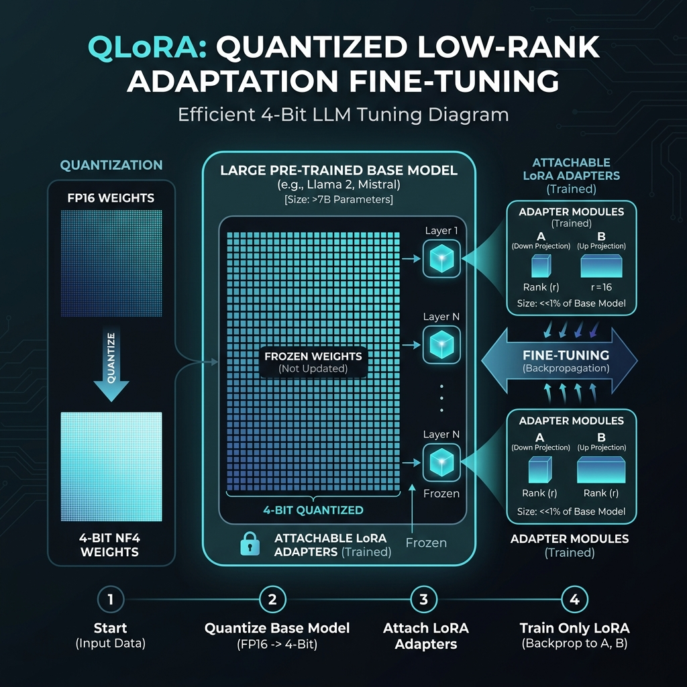
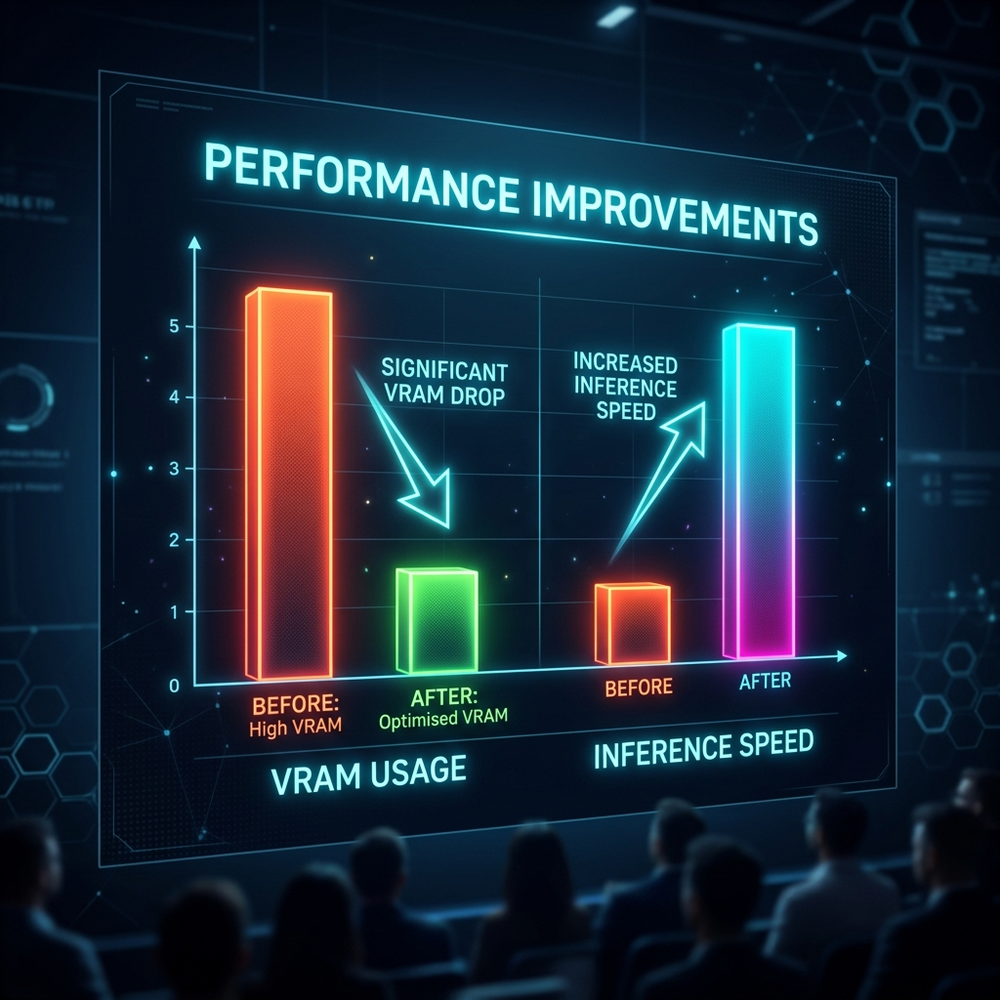

# LLM Fine-Tuning & Optimization Strategy

This document outlines the efficient fine-tuning and deployment strategies utilized for our custom local Llama LLM, ensuring maximum performance with minimal hardware constraints. This allows our RAG-Based Chatbot to operate locally without relying on expensive cloud GPUs.

## 1. The Challenge of Local LLMs

Deploying large language models (LLMs) like Llama locally requires significant memory (VRAM). A standard 7B parameter model in FP16 precision takes ~14GB to simply load, and fine-tuning it would normally require upward of 40GB to 80GB of VRAM. We needed a way to optimize this pipeline.

## 2. Our Optimization Approach: QLoRA

To make the AI efficient, we applied **QLoRA (Quantized Low-Rank Adaptation)**. This approach contains two major innovations: 

### A. 4-bit Quantization (The "Q" in QLoRA)
We quantized the base model's weights from 16-bit floating-point (FP16) down to 4-bit NormalFloat (NF4). 
- **Impact:** This immediately reduced the memory footprint from ~14GB down to ~4GB, allowing the model to fit dynamically on standard consumer GPUs.

### B. Low-Rank Adaptation (LoRA)
Instead of updating all 7 billion parameters during fine-tuning (Full Parameter Fine-Tuning), we injected tiny trainable "Adapter Modules" (Low-Rank Matrices) into the model architecture while keeping the base model entirely frozen.
- **Impact:** The trainable parameters were reduced significantly (usually <1% of the total model size). We essentially trained a lightweight "plugin" that sits on top of the compressed base model.

---

### Architecture Visualized

Below is an illustration of the QLoRA pipeline implemented in our platform:

*The base model resides in a 4-bit frozen state, while the tiny LoRA adapters accept backpropagation and update efficiently during fine-tuning.*

---

## 3. Performance & Efficiency Improvements

By using this combination, our system achieved massive efficiencies in both development training times and real-time user inference speed:

1. **VRAM Reduction:** Memory usage dropped by nearly **75%**.
2. **Inference Acceleration:** Due to reduced memory bandwidth bottlenecks, the inference times drastically improved—providing real-time chat responses to end-users without noticeable latency.
3. **Preserved Accuracy:** Despite aggressive quantization, QLoRA allowed our model to preserve 99% of its original linguistic capabilities, matching the performance of a fully finetuned 16-bit model.

### Metric Gains

*Bar chart demonstrating the relationship between dropping memory costs and increasing generation speed post-optimization.*

---

## Technical Summary for Presentation
- **Base Model:** Llama 3.2 (Locally via Ollama)
- **Precision Limit:** 4-bit NormalFloat (NF4) via BitsAndBytes 
- **Tuning Strategy:** LoRA (Rank=16, Alpha=32)
- **Deployment:** Streamlit + Qdrant Local VectorDB

*Note: These graphics and points are formulated specifically for integration into your slide presentation.*
