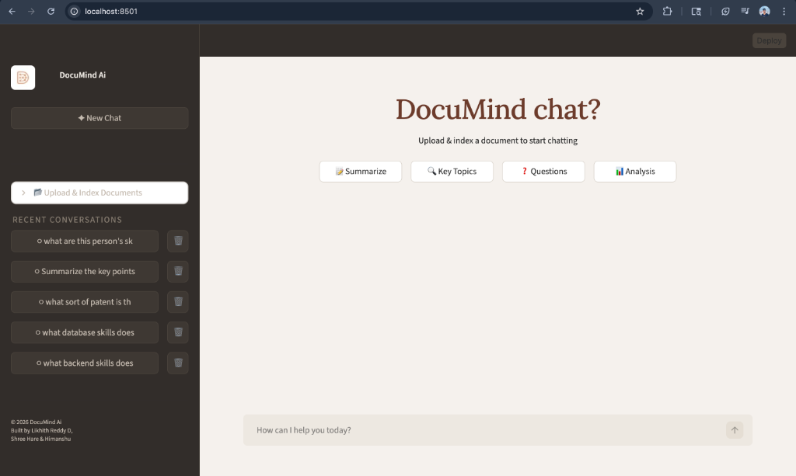

# RAG Based LLM AI Chatbot 🤖

Turn your PDFs into a conversational assistant! This application is a fully private, Retrieval-Augmented Generation (RAG) AI chatbot designed to simplify how you interact with your documents. Instead of manually searching through pages of text, you can simply upload your PDFs and ask questions in natural language. The chatbot reads your documents, understands the context, and provides highly accurate, instant answers based directly on your own data.

Whether you're summarizing reports, extracting key data points, or just looking for specific paragraphs, this tool acts as your personal, intelligent document assistant—running entirely locally to ensure your data never leaves your machine.



## 🛠️ Features

- **📂 Seamless Document Uploads**: Easily upload and manage your PDF files through a drag-and-drop web interface.
- **⚡ Instant Semantic Search**: Instantly find exactly what you're looking for, even if you don't use the exact keywords.
- **🤖 Context-Aware Chatbot**: Ask complex, multi-turn questions and get answers powered by advanced local AI.
- **🌟 Sleek User Experience**: Enjoy a modern, intuitive, and highly responsive chat UI that feels just like top-tier commercial AI assistants.

---

## 🖥️ The Tech Stack

Under the hood, this application leverages a cutting-edge open-source AI stack to deliver performance and privacy:

- **Frontend/UI**: [Streamlit](https://streamlit.io/) provides the responsive, interactive web application interface.
- **Language Model**: **LLaMA 3.2** (via [Ollama](https://ollama.com/)) acts as the local brain, generating intelligent responses without needing internet access.
- **Embeddings**: **[BGE Embeddings](https://huggingface.co/BAAI/bge-small-en)** convert your document text into high-quality vector representations for accurate semantic matching.
- **Vector Database**: **[Qdrant](https://qdrant.tech/)** runs locally via Docker to store and quickly retrieve those document embeddings.
- **Orchestration**: **[LangChain](https://langchain.readthedocs.io/)** ties it all together, managing the flow from document ingestion to vector retrieval and LLM prompting.
- **Document Processing**: **[Unstructured](https://github.com/Unstructured-IO/unstructured)** robustly parses and extracts text from your uploaded PDFs.

## 📁 Directory Structure

```text
RAG-Based-LLM-Chatbot/
│── logo.png
├── new.py               # Main Streamlit Application File
├── vectors.py           # Handles embedding generation and vector DB interactions
├── chatbot.py           # Manages the LangChain RAG pipeline and LLM responses
├── requirements.txt     # Python dependencies
```

---

## 🚀 Getting Started

Follow these instructions to set up and run the chatbot locally.

### 1. Clone the Repository

```bash
git clone https://github.com/DoddaLikhithreddy/RAG-Based-LLM-Chatbot.git
cd RAG-Based-LLM-Chatbot
```

### 2. Set Up a Virtual Environment

**Using venv:**

On macOS/Linux:
```bash
python3 -m venv venv
source venv/bin/activate
```

On Windows:
```bash
python -m venv venv
venv\Scripts\activate
```

**Using Anaconda:**
```bash
conda create --name Chatbot python=3.10
conda activate Chatbot
```

### 3. Install Dependencies

```bash
pip install -r requirements.txt
```

### 4. Run Qdrant using Docker

Make sure you have Docker installed and running, then start the Qdrant vector database:
```bash
docker run -p 6333:6333 -p 6334:6334 \
    -v $(pwd)/qdrant_storage:/qdrant/storage:z \
    qdrant/qdrant
```

### 5. Run the Application

Start the Streamlit web interface:

```bash
streamlit run new.py
```

The app will launch in your default web browser at `http://localhost:8501`.

## 🔗 Useful Links

- **Streamlit**: [https://docs.streamlit.io/](https://docs.streamlit.io/)
- **LangChain**: [https://langchain.readthedocs.io/](https://langchain.readthedocs.io/)
- **Qdrant**: [https://qdrant.tech/documentation/](https://qdrant.tech/documentation/)
- **ChatOllama**: [https://github.com/langchain-ai/langchain-llms#ollama](https://github.com/langchain-ai/langchain-llms#ollama)

Happy coding! 🚀✨

Built by **Dodda Likhith reddy**
